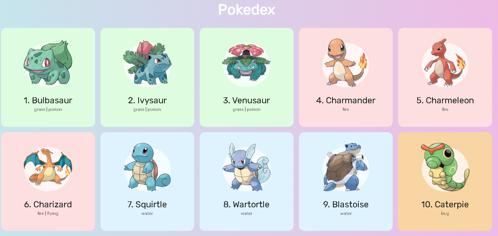

# Pokedex

## Goals with this project
Better understanding of:
- Promises
- Fetch/catch functions
- Http requests
- CSS tricks
- General javascript using

Essentialy, this Pokedex application is feeded by a pokemon api, with 150 pokemons of frist generation. The app function is to get all oh those characters on screen and display and name. 

## Installation
- Install **live server** extension for vscode

## Development setup

As said before, for now i'm only using vscode live server extension.

## Meta

Vasco Weyne – [LinkedIn page](https://www.linkedin.com/in/vascoweyne/) – vasco.weyne@gmail.com

[https://github.com/vascoweyne/pokedex.git](https://github.com/vascoweyne/pokedex.git)